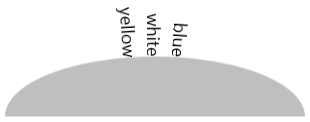
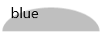
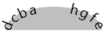

# LayoutPath enums

*inside CustomControls.Enums namespace*

This section contains information about enumerations you can use with `LayoutPath` control.

### ChildAlignment 
Controls where `Children` of `LayoutPath` will be placed

| Inner | Center | Outer |
| :---: | :----: | :---: |
|  |  |  |
| Children are placed inside Path | Children are placed at center of Path | Children are placed outside Path |

### Orientations 
Controls the orientation of `Children` along path

| None | ToPath | ToPathReversed | Vertical | VerticalReversed
| :--: | :----: | :------------: | :------: | :--------------: |
|  |  |  |  |  |
| not rotating | following path | following path reversed | following path vertically | following path vertically reversed |

### Behaviors 
Controls how `Children` behave when they are off `PathProgress` range [0-100]

| Default | Collapse | Stack |
| :-----: | :------: | :----: |
|  |  |  |
| children loop | children collapse | children stack |

*This example includes 8 letters one after another. The last 4 [e-h] have progress values lower than 0. Behavior is applied to `StartBehavior`*

