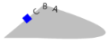

# Layout Path 
*namespace: CustomControls.Controls*

A control used for placing / animating UIElements along a path.

It provides some usefull options such as rotation / translation smoothing, start / end behavior and more.

#### Declaration / Instantiation

In order to start using `LayoutPath`, you must instantiate a class and specify the `Path` property.
`Path` is then analyzed and converted into an [ExtendedPathGeometry](extendedPathGeometryUG.md) for getting point and rotation at a fraction length. 
###### C#:
`LayoutPath` provides 3 constructors and an extension method for instantiating a new `LayoutPath` class.
```cs
//Default constructor
public LayoutPath();
//Overloaded constructor
public LayoutPath(PathGeometry pathGeometry);
//extension method
public static LayoutPath ToLayoutPath(this PathGeometry geometry);
```
So, you can create a new `LayoutPath` as follows:
```cs
PathGeometry yourPathGeometry = new PathGeometry();
//Instantiate by setting property
LayoutPath layoutPath1=new LayoutPath() { Path = yourPathGeometry };
//Instantiate by using contructor
LayoutPath layoutPath2 = new LayoutPath(pathGeometry: yourPathGeometry);
//instantiate by using path markup syntax
LayoutPath layoutPath3 = new LayoutPath(pathMarkup: "M 10,100 C 10,300 300,-200 300,100");
```

*Note: `LayoutPath` uses [StringToPathGeometryConverter](https://stringtopathgeometry.codeplex.com/SourceControl/latest#PathConverter/PathConverter/StringToPathGeometryConverter.cs)
codeplex project for converting path markup to path geometry and vice versa.*

###### Xaml:
You can declare a `LayoutPath` as follows:
```xml
<!-- initialize by using path markup -->
<controls:LayoutPath Path="M 10,100 C 10,300 300,-200 300,100">
	<!-- specify CacheMode="BitmapCache" to avoid flickering when animating text block -->
    <TextBlock Text="First child" CacheMode="BitmapCache"/>
    <TextBlock Text="Second child" />
</controls:LayoutPath>
<!--initialize by specifying Path geometry-->
<controls:LayoutPath>
    <controls:LayoutPath.Path>
        <PathGeometry>
            <PathFigure IsClosed="True" StartPoint="0,50">
                <LineSegment Point="150,0"/>
                <QuadraticBezierSegment Point1="280,60" Point2="400,0" />
                <ArcSegment Point="870,50" Size="9,3" SweepDirection="Clockwise"/>
            </PathFigure>
        </PathGeometry>
    </controls:LayoutPath.Path> 
    <TextBlock Text="First child" CacheMode="BitmapCache"/>    
    <Button Content="Second child" />
</controls:LayoutPath>
```

#### Properties

Properties that you can specify on `LayoutPath` control:

| Property | Description |
| :------- | :---------- |
| `Path` | Geometry that will be used for translating `Children` |
| `PathVisibility` | Visibility of `Path` |
| `PathProgress` | Transforms `Children` at fraction length *(value in Percent 0-100)* |
| `ExtendedGeometry` | The [ExtendedPathGeometry](extendedPathGeometryUG.md), mainly used for getting point at fraction length |
| `Children` | Children that are positioned along `Path` |
| `ChildrenAlignment` | [ChildAlignment](layoutPathEnumsUG.md#childalignment) of `Children` along `Path` |
| `ChildrenEasingFunction` | The easing function each child will have when moving along `Path` |
| `ChildrenOrientation` | The [Orientation](layoutPathEnumsUG.md#orientations) of `Children` when moving along `Path` |
| `ChildrenPadding` | The distance that `Children` will keep between each other *(in percent of total length)* |
| `CurrentPosition` | The *Point* at fraction length of `Path` on current `PathProgress` |
| `CurrentLength` | The fraction length for `CurrentPosition` |
| `CurrentRotation` | The degrees at fraction length of `Path` on current `PathProgress` |
| `StartBehavior` | `Children` start [Behavior](layoutPathEnumsUG.md#behaviors) |
| `EndBehavior` | `Children` end [Behavior](layoutPathEnumsUG.md#behaviors) |
| `Stretch` | Describes how `LayoutPath` is resized to fill its allocated space |
| `RotationSmoothingDefault` | Smooths `Children` rotation when animating along `Path` |
| `TranslationSmoothingDefault` | Smooths `Children` translation when animating along `Path` |

#### Attached Properties

Properties that you can specify on `LayoutPath` `Children`.

| Property | Description |
| :------- | :---------- |
| `Progress` | Specify explicitly the `Progress` of child. <br/>*Setting this property will force child to ignore `LayoutPath.PathProgress` property* |
| `ProgressOffset` | The child progress offset property. *Affects all next child elements.* |
| `RotationSmoothing` | Specify explicitly the rotation smoothing of child. <br/>*Setting this property will force child to ignore `LayoutPath.RotationSmoothingDefault` property* |
| `RotationSmoothing` | Specify explicitly the translation smoothing of child. <br/>*Setting this property will force child to ignore `LayoutPath.TranslationSmoothingDefault` property* |


#### Methods

| Method | Description |
| :------- | :---------- |
| ResetSmoothingAndRefresh | Call this to reset smoothing and position items to `PathProgress`. Useful when there is no active storyboard for applying changes. |

#### FAQ
**Setting Progress on LayoutPath doesn't move Children** <br/>
That's an expected behavior. You have to set **`PathProgress`** property instead. **`Progress`** is an attached property and can be used for controlling a child's progress individually.

**Rotation / Translation smoothing does not have any effect** <br />
Same as previous one. Set **`Rotation / Translation smoothing default`** property.

**Text is flickering when moving along path** <br/>
Set `CacheMode="BitmapCache"` in order to avoid text flickering in an animation.

**Specify ChildrenPadding in pixels** <br />
You can set ChildrenPadding in percent. If you wish to set it in pixels use the following code:
```cs
double distanceInPixels = 20.0;
var percent = distanceInPixels / layoutPath.ExtendedGeometry.PathLength;
layoutPath.ChildrenPadding = percent;
```