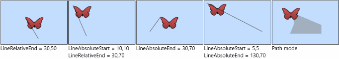

# Path Animation
*A GitHub project containing ExtendedPathGeometry, LayoutPath and MotionPath elements for windows 10 UWP.*

### Extended Path Geometry
A class, extending current windows 10 PathGeometry class for providing missing functionality ([user guide](Documentation/extendedPathGeometryUG.md)).

### Layout Path 
A control used for placing / animating UIElements along a path ([user guide](Documentation/layoutPathUG.md)).

 

### Motion Path
A control used for moving an element by specifying coordinates or a path geometry.
([user guide](Documentation/motionPathUG.md)).
 
 

